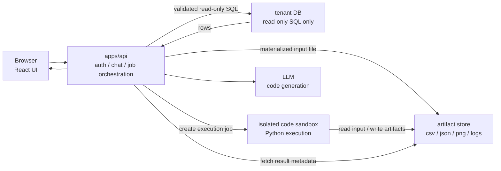

# Code Interpreter

このドキュメントは、Text-to-SQL SampleにJupyter Notebookの自然言語版、つまりLLMがPythonコードを生成し、それを実行して分析結果を返すCode Interpreter機能を追加する場合の実行基盤と安全境界をまとめるものである。

2026-06-23時点の公式ドキュメントを参照している。各managed serviceの仕様、価格、提供リージョン、制限は変わり得るため、実装前に再確認する。

参照元:

- [E2B Documentation](https://e2b.dev/docs)
- [E2B Analyze data with AI](https://e2b.dev/docs/code-interpreting/analyze-data-with-ai)
- [Amazon Bedrock AgentCore Code Interpreter](https://docs.aws.amazon.com/bedrock-agentcore/latest/devguide/code-interpreter-tool.html)
- [Amazon Bedrock AgentCore Code Interpreter resource management](https://docs.aws.amazon.com/bedrock-agentcore/latest/devguide/code-interpreter-resource-management.html)
- [Gemini API Code Execution](https://docs.cloud.google.com/gemini-enterprise-agent-platform/reference/models/code-execution-api)
- [GKE Agent Sandbox](https://docs.cloud.google.com/kubernetes-engine/docs/how-to/agent-sandbox)
- [GKE Sandbox](https://docs.cloud.google.com/kubernetes-engine/docs/concepts/sandbox-pods)
- [Cloud Run container runtime contract](https://docs.cloud.google.com/run/docs/container-contract)

## 結論

LLMが生成したPythonコードは、ユーザー入力そのものより危険なuntrusted codeとして扱うべきである。したがって、`apps/api` のNode.jsプロセス、PostgreSQLコンテナ、またはアプリ本体と同じ権限境界では実行しない。

このrepoにCode Interpreter機能を追加する場合、`apps/api` はコード実行ジョブの作成、認証、履歴保存、入出力の受け渡しだけを担当する。Pythonコードの実行は、別プロセス、別コンテナ、またはmanaged sandboxへ分離する。

推奨する基本方針は次である。

- `apps/api` は任意Pythonコードを直接実行しない。
- sandboxはtenant DBの接続情報を持たない。
- SQL実行は既存のread-only SQL guardrailを通す。
- sandboxへ渡す入力は、SQL実行結果をmaterializeしたCSV、Parquet、JSONなどに限定する。
- sandboxの実行結果は、stdout、stderr、生成ファイル、可視化画像、exit code、実行時間として保存する。
- 1ジョブ1sandboxを原則とし、実行後に破棄する。

## 既存アーキテクチャとの境界

現在のアプリケーションは、自然言語をSQLへ変換し、tenant DBへ読み取り専用で実行し、結果をUIへ返すText-to-SQLサンプルである。SQL実行は `apps/api/src/sql.ts` の検証とread-only transactionにより制御される。

Code Interpreterを追加しても、このSQL安全境界は崩さない。Python sandboxからtenant DBへ直接接続させる設計は避ける。



この構成では、sandboxが壊れてもtenant DB credential、OpenAI API key、common DB、API processへ直接到達しない。Code Interpreterの信用境界は、SQL実行境界よりさらに外側に置く。

## 必要なsandbox制約

ローカルMVPをDockerで作る場合でも、単にコンテナを使うだけでは不十分である。少なくとも次を強制する。

| 制約 | 目的 |
| --- | --- |
| 1ジョブ1コンテナ | 実行間の状態混入を防ぐ |
| 実行後破棄 | 永続化された攻撃コードや汚染状態を残さない |
| network disabledをデフォルト | 外部送信、credential exfiltration、任意API呼び出しを防ぐ |
| read-only root filesystem | sandbox内の改変面を減らす |
| tmpfs workspaceのみ書き込み可 | 出力場所を限定し、破棄しやすくする |
| host filesystem mountなし | repo、秘密情報、SSH keyへのアクセスを防ぐ |
| non-root user | container内権限を下げる |
| CPU / memory / pids / disk制限 | 無限ループ、fork bomb、大量メモリ確保を止める |
| wall-clock timeout | 長時間実行を止める |
| capabilities drop all | Linux capability経由の権限拡大を避ける |
| no-new-privileges | setuid等による権限上昇を避ける |
| seccomp / AppArmor / gVisor | syscall面の攻撃面を減らす |
| secret envなし | API keyやDB credential漏えいを防ぐ |

Dockerは実行基盤の候補であり、完全な信用境界ではない。より強い隔離が必要な場合は、gVisor、Firecracker、またはmanaged code sandboxを使う。

## サービス選択肢

### E2B

E2Bは、この用途に最も直接対応するmanaged sandboxである。公式ドキュメントでは、agentがcode、data processing、toolsを安全に実行するisolated sandboxとして説明されている。CSVなどのデータをsandboxへアップロードし、LLMが生成したPythonコードを実行し、結果をアプリへ返す流れが想定されている。

このrepoに対する適合度は高い。理由は、既存のOpenAI / Vercel AI SDK構成を保ったまま、コード実行基盤だけを外部化できるためである。LLM providerに強く縛られず、`apps/api` からsandbox APIを呼び出す形にできる。

向いている用途:

- 早くMVPを作る。
- OpenAI、Anthropic、Vercel AI SDKなどと組み合わせる。
- Python分析、CSV処理、グラフ生成を行う。
- 自前でsandbox orchestrationを持ちたくない。

注意点:

- データをE2Bへ送るため、データ持ち出し境界の判断が必要である。
- network、package install、session lifetime、artifact保存、監査ログの仕様を実装前に確認する必要がある。

### Amazon Bedrock AgentCore Code Interpreter

AWSで同レイヤーに最も近いのはAmazon Bedrock AgentCore Code Interpreterである。公式ドキュメントでは、AI agentがsandbox environmentでcodeを書き、実行し、debugするための機能として説明されている。

特徴は、containerized environment、session、file operations、S3連携、network modeをAWS側で管理できることである。network modeにはSandbox、Public、VPCがあり、Sandbox modeでは外部ネットワークアクセスが限定され、S3 data operationsが可能である。

向いている用途:

- AWS内に閉じたい。
- S3に置いた入力ファイルを分析したい。
- IAM roleでsandboxのAWS resource accessを管理したい。
- VPC modeで社内AWS resourceへ限定接続したい。

注意点:

- Bedrock AgentCoreの運用モデル、利用可能リージョン、権限設計に依存する。
- VPC modeでprivate resourceへ接続できることは便利だが、sandboxからDBへ直接接続させる設計はこのrepoでは避けるべきである。

### Gemini API Code Execution

Gemini API Code Executionは、Gemini modelにcode execution toolを渡し、modelがPythonコードを生成して実行結果を使いながら回答する機能である。小さな計算やテキスト処理には近い。

ただし、公式ドキュメント上の制限としてfile I/O非対応、最大30秒timeoutがある。したがって、ユーザーがアップロードしたCSV/ExcelをNotebook的に処理し、生成ファイルや図表を扱う用途には弱い。

向いている用途:

- Gemini model中心で、短いPython計算を回答改善に使う。
- file I/Oや長時間実行を必要としない。
- managed sandboxというより、model-integrated toolとして使いたい。

注意点:

- Jupyter Notebook的な継続セッションやファイル処理には制約が強い。
- LLM providerとcode executionが一体化するため、既存のOpenAI / AI SDK構成からは設計変更が大きい。

### GKE Agent Sandbox / GKE Sandbox

GCPで実行基盤を自作するなら、GKE Agent SandboxまたはGKE Sandboxが候補になる。GKE SandboxはgVisorを使って、unknownまたはuntrusted codeを実行するPodからhost kernelを保護する追加レイヤーである。GKE Agent SandboxはAI-generated codeを安全に実行するためのsandboxed Python environment構成に寄せた機能である。

これはE2Bのような即時利用できるhosted Code Interpreter APIではなく、Kubernetes上にrunner基盤を構築するためのinfra寄りの選択肢である。

向いている用途:

- GCP上に自前runnerを持ちたい。
- Kubernetes運用が許容できる。
- sandbox image、依存パッケージ、network policy、artifact保存を細かく制御したい。

注意点:

- E2BやAWS AgentCore Code Interpreterより実装・運用負荷が高い。
- Kubernetes、node pool、admission policy、observability、job cleanupを設計する必要がある。

### Cloud Run / ECS Fargate / Lambda

Cloud Run、ECS Fargate、Lambdaなどは、Code Interpreterそのものではない。自前runnerをホストする土台である。

Cloud Run first generationはgVisor sandboxを使うが、Cloud Run jobはsecond generation environmentであり、仕様差がある。GCP公式ドキュメントでも、process/system call restrictionsやprivileged container非対応などが説明されている。

これらを使う場合は、アプリ側で次を実装する必要がある。

- job queue
- sandbox container image
- per-job workspace
- resource limits
- timeout
- network policy
- artifact store
- cleanup
- audit log

## 比較

| 選択肢 | レイヤー | 適合度 | コメント |
| --- | --- | --- | --- |
| E2B | managed code sandbox | 高 | 最速でCode Interpreterを実装しやすい |
| AWS AgentCore Code Interpreter | managed code interpreter | 高 | AWS内に閉じるなら最も近い |
| Gemini API Code Execution | model-integrated code execution | 中 | 短時間・file I/OなしのPython実行向け |
| GKE Agent Sandbox | sandbox infra | 中 | 自前runner基盤をGCPで作る場合に有効 |
| Cloud Run / ECS Fargate / Lambda | generic runtime | 低から中 | runnerを自作する前提 |
| local Docker runner | local MVP infra | 中 | 検証にはよいが、本番は追加隔離が必要 |

## このrepoでの推奨実装順

最初からNotebook全体を実装しない。SQL結果に対するPython分析という小さい閉じた用途から始める。

1. `docs/adr` にCode Interpreterの安全境界を記録する。
2. `apps/api` にcode execution provider interfaceを作る。
3. provider実装としてE2BまたはAWS AgentCore Code Interpreterを1つ選ぶ。
4. 既存のSQL実行結果をCSVまたはJSONとしてartifact storeへ保存する。
5. sandboxへ入力ファイルと生成Pythonコードを渡す。
6. stdout、stderr、生成ファイル、画像、exit code、durationを受け取る。
7. chat message partsとして実行コード、ログ、生成画像、downloadable artifactを表示する。
8. `sql_runs` とは別に `code_runs` 相当の監査テーブルを追加する。

provider interfaceは次のような最小形から始める。

```ts
type CodeRunInput = {
  code: string;
  files: Array<{
    name: string;
    contentType: string;
    bytes: Uint8Array;
  }>;
  timeoutMs: number;
};

type CodeRunResult = {
  status: "success" | "failed" | "timeout";
  stdout: string;
  stderr: string;
  durationMs: number;
  artifacts: Array<{
    name: string;
    contentType: string;
    bytes: Uint8Array;
  }>;
};

interface CodeInterpreterProvider {
  run(input: CodeRunInput): Promise<CodeRunResult>;
}
```

このinterfaceにより、E2B、AWS AgentCore Code Interpreter、local Docker runnerを差し替えられる。

## やってはいけないこと

- `child_process.exec("python ...")` を `apps/api` から直接呼ぶ。
- sandboxへ `DATABASE_URL`、`OPENAI_API_KEY`、AWS admin credentialを渡す。
- tenant DBへsandboxから直接接続させる。
- host repoやhome directoryをsandboxへmountする。
- network unrestrictedをデフォルトにする。
- 生成コードを監査ログなしで実行する。
- 前回sessionのfilesystem stateを別ユーザーの実行に再利用する。
- LLMが生成したコードを「AIが出したから安全」と扱う。

## 判断

このrepoでは、Code InterpreterはText-to-SQLの内側ではなく、SQL実行結果の外側に置くべきである。

具体的には、既存の `inspectSchema` と `executeSql` によるDB access boundaryを維持し、その結果をsandbox入力へ変換する。Python実行基盤はE2BまたはAWS AgentCore Code Interpreterのようなmanaged sandboxへ分離する。GCPを使う場合は、Gemini API Code Executionは軽い計算向け、GKE Agent Sandboxは自前runner向けと整理する。

最小実装の第一候補はE2Bである。AWSへ寄せる制約がある場合はAmazon Bedrock AgentCore Code Interpreterを第一候補にする。どちらの場合も、sandboxはDB credentialを持たず、入力データだけを受け取る設計を完了条件にする。
