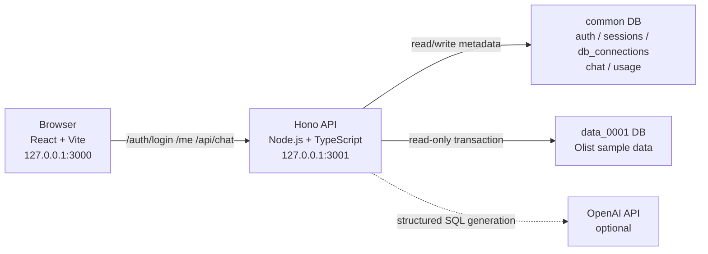
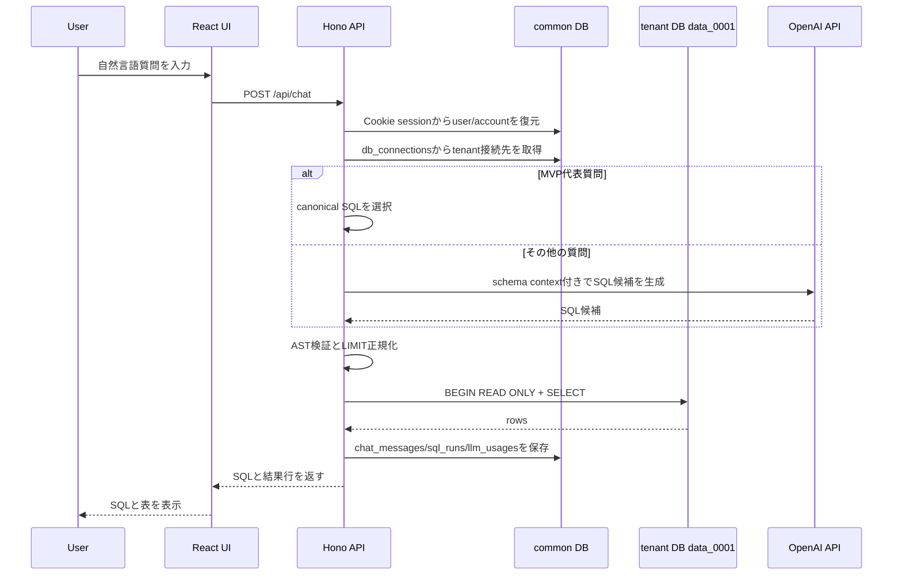

# Text-to-SQL Architecture

## 目的

このアプリケーションは、自然言語の質問をPostgreSQL向けSQLへ変換し、tenant DBへ読み取り専用で実行し、結果を表形式で返すText-to-SQLサンプルである。

ローカルMVPの代表入力は次である。

```text
2018年の売り上げランキング上位10位を出して
```

この入力に対して、アプリケーションは `orders` と `order_items` を結合し、2018年の `order_items.price` 合計をseller別に集計するSQLを実行する。

## ローカル構成



ローカルでは次の2つのPostgreSQL DBを使う。

| DB | 役割 |
| --- | --- |
| `common` | アカウント、ユーザー、セッション、tenant接続定義、チャット履歴、SQL実行履歴、LLM利用量を保持する |
| `data_0001` | `account_id=1` のtenantデータを保持する |

`common.db_connections` には `account_id=1` の接続先として `localhost:5432/data_0001` を保存する。APIはクライアントから `account_id` やDB名を受け取らず、Cookieセッションからユーザーを復元し、サーバ側でtenant接続先を解決する。

## ディレクトリ構成

```text
apps/api
  src/auth.ts            Cookieセッション認証
  src/chat.ts            Text-to-SQL処理のアプリケーションサービス
  src/db.ts              common DBとtenant DB接続
  src/llm.ts             SQL生成
  src/sql.ts             SQL検証とread-only実行
  src/routes.ts          HTTP API
  src/schema-context.ts  LLMへ渡す固定schema context

apps/web
  src/main.tsx           React UI
  src/styles.css         UI style
  vite.config.ts         API proxy設定

packages/shared
  src/index.ts           Web/API共有型
```

## リクエスト処理

自然言語入力から結果表示までの流れは次である。



## 認証境界

認証はMVP用のCookieベース実装である。

- `POST /auth/login` が `sessions` にhash化済みtokenを保存する。
- ブラウザにはHTTP only Cookie `sid` を保存する。
- `GET /me`, `GET /chat-threads`, `POST /api/chat` は `requireAuth` middlewareで保護する。
- APIはCookieから復元した `users.account_id` を信頼し、クライアント指定の `account_id` は受け取らない。

デモログインは `demo@example.com` / `password` である。これはローカルMVP用であり、本番認証ではない。

## SQL生成

SQL生成は `apps/api/src/llm.ts` に集約している。

MVP代表質問は、LLM出力の揺れを避けるためcanonical SQLを優先する。このSQLはseller別の2018年売上ランキングを返す。

```sql
SELECT
  oi.seller_id,
  SUM(oi.price) AS total_sales,
  COUNT(DISTINCT o.order_id) AS order_count
FROM orders o
JOIN order_items oi ON oi.order_id = o.order_id
WHERE o.order_purchase_timestamp >= TIMESTAMP '2018-01-01 00:00:00'
  AND o.order_purchase_timestamp < TIMESTAMP '2019-01-01 00:00:00'
GROUP BY oi.seller_id
ORDER BY total_sales DESC
LIMIT 10;
```

その他の質問では、`@ai-sdk/openai` とAI SDKの構造化出力を使い、`sql` と `explanation` を含むJSONを生成する。`OPENAI_API_KEY` が未設定、または生成に失敗した場合はローカルfallback SQLへ切り替える。

## Vercel AI SDKの利用箇所

Vercel AI SDKは、自然言語からSQL候補を生成するLLM呼び出しの薄いadapterとしてだけ使っている。認証、tenant解決、SQL検証、SQL実行、履歴保存はAI SDKへ委譲せず、アプリケーション側で制御する。

利用箇所は `apps/api/src/llm.ts` である。`apps/web` ではAI SDKを直接使っていない。

```ts
import { openai } from "@ai-sdk/openai";
import { generateObject } from "ai";
```

役割分担は次である。

| ファイル | 役割 |
| --- | --- |
| `apps/api/package.json` | `ai` と `@ai-sdk/openai` をAPI側dependencyとして持つ |
| `apps/api/src/config.ts` | `OPENAI_API_KEY` と `OPENAI_MODEL` をサーバ環境変数から読む |
| `apps/api/src/llm.ts` | AI SDKを呼び、`sql` / `explanation` の構造化出力を受け取る |
| `apps/api/src/chat.ts` | `generateSql` の結果をSQL検証・実行へ渡し、token usageを `llm_usages` に保存する |
| `apps/api/src/schema-context.ts` | LLMへ渡す固定schema contextを定義する |
| `apps/api/src/sql.ts` | AI SDKの出力を信用せず、実行前に必ずSQLを検証・正規化する |

実行時の呼び出し経路は次である。

```text
POST /api/chat
  -> handleChat(user, question, threadId)
    -> generateSql(question)
      -> generateObject({ model: openai(config.openai.model), schema, system, prompt })
    -> validateAndNormalizeSql(generated.sql)
    -> executeReadOnlySql(...)
    -> chat_messages / sql_runs / llm_usages へ保存
```

`generateObject` を使う理由は、LLM出力を自由文ではなく次のZod schemaに合わせたobjectとして受け取るためである。

```ts
const sqlSchema = z.object({
  sql: z.string(),
  explanation: z.string()
});
```

このため `apps/api/src/llm.ts` は、AI SDKから返る `result.object.sql` をSQL候補、`result.object.explanation` を生成理由として扱える。加えて `result.usage` から `inputTokens`、`outputTokens`、`totalTokens` を取得し、`apps/api/src/chat.ts` が `llm_usages` に保存する。

AI SDKへ渡すpromptは2層で構成している。

- `system`: PostgreSQL向けText-to-SQL generatorとしての役割、安全な単一SELECTだけを返す制約、固定schema contextを渡す。
- `prompt`: ユーザーの自然言語質問を `User question: ...` として渡す。

`model: openai(config.openai.model)` は、`@ai-sdk/openai` のOpenAI providerに対して利用モデルを指定する箇所である。モデル名は `OPENAI_MODEL` で差し替え可能で、未指定時は `gpt-4.1-mini` を使う。`OPENAI_API_KEY` はサーバ側環境変数としてだけ扱い、ブラウザへ渡さない。

ただし、すべての質問でAI SDKを呼ぶわけではない。MVP代表質問は結果を安定させるためcanonical SQLを返し、`OPENAI_API_KEY` 未設定時や生成失敗時もfallback SQLを返す。この場合 `generationMode` は `fallback`、token usageは0で保存される。

重要な境界は、AI SDKが「SQL候補を生成するだけ」である点である。SQLを実行してよいかは `apps/api/src/sql.ts` のguardrailが決める。したがって、LLMが危険なSQLや複数statementを返しても、tenant DB実行前に拒否または正規化される。

現在の実装は `ai` v5系の `generateObject` を前提にしている。将来AI SDK v6系へ上げる場合は、構造化出力APIの変更に合わせて `apps/api/src/llm.ts` のadapter部分だけを更新する。

## SQL安全策

SQL実行前の防御は `apps/api/src/sql.ts` に集約している。

主な検証は次である。

- 末尾のセミコロンを取り除く。
- `insert`, `update`, `delete`, `drop`, `copy`, `call`, `do` などの危険keywordを拒否する。
- `pg_sleep`, `dblink`, `lo_import`, `pg_read_file` などの危険関数を拒否する。
- `pgsql-ast-parser` で単一statementであることを確認する。
- AST rootが `select` であることを確認する。
- `LIMIT` がなければ `LIMIT 100` を付与する。
- `LIMIT` が100を超える場合は100へ丸める。

実行時はtenant DBへ読み取り専用ユーザーで接続し、さらに `BEGIN READ ONLY` と `SET LOCAL statement_timeout = '5s'` を使う。LLMがSQLを生成しても、実行可否は必ずサーバ側guardrailが決める。

## 永続化

`POST /api/chat` は処理完了時に次を保存する。

| テーブル | 保存内容 |
| --- | --- |
| `chat_threads` | ユーザーごとのチャットスレッド |
| `chat_messages` | user/assistant messageとUI parts |
| `sql_runs` | 生成SQL、正規化SQL、結果列、結果行、行数、実行時間 |
| `llm_usages` | provider/model/token数/推定料金 |

このため、UIに返す結果とDBに残る監査情報は同じ処理から作られる。

## UI

React UIは `apps/web/src/main.tsx` に実装している。

画面は次の要素で構成する。

- ログインフォーム
- スレッド一覧
- 自然言語質問入力
- 会話ログ
- 生成SQL表示
- SQL実行結果テーブル

Vite dev serverは `127.0.0.1:3000` で起動し、`/api`, `/auth`, `/me`, `/chat-threads` を `127.0.0.1:3001` のHono APIへproxyする。

## ローカル確認

起動手順は次である。

```bash
npm run db:setup
npm run dev
```

検証コマンドは次である。

```bash
npm run lint
npm test
npm run build
```

in-app browserで代表質問を送信した場合、次の列を持つ10行の結果が返ることを合格条件とする。

```text
seller_id
total_sales
order_count
```
