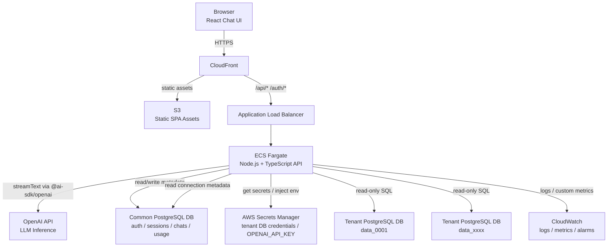
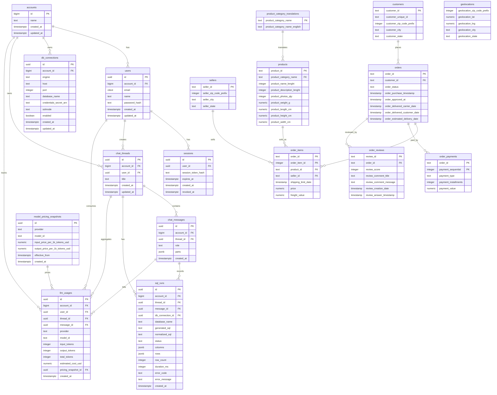

# Text-to-SQL AIエージェント DesignDoc

## 1. 要件

### 1.1 目的

自然言語のチャット入力からSQLを生成し、アカウントごとに分離されたtenant DBへ読み取りクエリを実行し、そのSQL実行結果を返すAIエージェントを構築する。

代表ユースケースは次である。

```text
2018年の売り上げランキング上位10位を出して
```

この入力に対して、AIエージェントは対象tenant DBのスキーマを踏まえてSQLを生成し、安全性を検証し、読み取り専用接続でSQLを実行し、結果行をチャット画面へ返す。

### 1.2 機能要件

- 自然言語入力を受け取り、PostgreSQL向けSQLを生成する。
- 生成SQLを実行し、実行結果を表形式で返す。
- アカウントごとに接続先DBを分けるマルチテナント構成とする。
- `account_id=1` のtenantデータは `data_0001` データベースに格納する。
- 共通DBの `db_connections` で、アカウントごとのtenant DB接続先を管理する。
- アカウント配下にユーザーを持ち、ユーザーごとにチャットセッションと履歴を永続化する。
- テナントごとのLLM token利用量と推定利用料を永続化する。
- 認証はCookieベースの簡易ログインとする。

### 1.3 非機能要件

- tenant DBへのSQL実行は読み取り専用に限定する。
- SQLはAST検証を通過した単一statementのみ実行する。
- 許可するSQLは `SELECT` / `WITH` / 集計 / window関数までとする。
- DDL、DML、複文、危険関数、任意の管理系SQLは拒否する。
- DB credentialは平文保存せず、AWS Secrets Managerで管理する。
- OpenAI API keyは `OPENAI_API_KEY` としてサーバ環境変数に注入し、AI SDKのOpenAI providerに参照させる。
- バックエンドはVercelではなくAWS ECS Fargateにホストする。
- フロントエンドはS3へ静的配信し、CloudFront経由で公開する。

### 1.4 サンプルデータ前提

`data/` のCSVはOlist風の注文、顧客、商品、販売者、支払い、レビュー、地理データである。tenant DBは全アカウントで同一スキーマとする。

サンプル注文データは2016-2018年台である。MVPの代表ユースケースでは、ユーザー入力を「2018年の売り上げランキング上位10位を出して」とし、対象期間は `2018-01-01 00:00:00` 以上 `2019-01-01 00:00:00` 未満である。

## 2. 全体アーキテクチャ

### 2.1 構成概要

- React SPAはS3に配置し、CloudFrontで配信する。
- CloudFrontは静的ファイルをS3へ、`/api/*` と `/auth/*` をALB経由でECSへルーティングする。
- ECS Fargate上のNode.js APIが認証、チャット履歴、Text-to-SQL処理、token利用量保存を担当する。
- 共通DBは認証、セッション、tenant接続情報、チャット履歴、LLM利用量を保持する。
- tenant DBはアカウントごとの業務データを保持する。
- OpenAI APIはSQL生成と必要な推論に利用する。
- Secrets Managerはtenant DB credentialとOpenAI API keyを保持する。
- BedrockはMVPでは採用しない。判断理由は [ADR-0001](adr/0001-use-openai-api-instead-of-bedrock.md) に記録する。
- Google ADKとStrands Agents SDKはMVPでは採用しない。判断理由は [ADR-0002](adr/0002-do-not-use-adk-or-strands-agents-sdk-for-mvp.md) に記録する。

### 2.2 アーキテクチャ図



### 2.3 リクエスト処理の境界

クライアントから `account_id` や `user_id` は受け取らない。APIはCookieセッションからユーザーを特定し、共通DBの `users.account_id` を信頼する。tenant DB接続先は必ずサーバ側で `db_connections` から解決する。

## 3. 技術スタック

| 領域 | 採用技術 | 採用理由 |
| --- | --- | --- |
| フロントエンド | React + Vite | S3/CloudFrontに静的配信しやすく、SPAとして軽量である |
| チャットUI | Vercel AI SDK UI `@ai-sdk/react` | `useChat` によりストリーミングチャットUIを実装しやすい |
| バックエンド | Node.js + TypeScript + Hono | ECS上で動かしやすく、Fetch API互換のハンドラでAI SDKと相性が良い |
| AI SDK | Vercel AI SDK Core | `streamText`、multi-step tool calling、usage取得を利用する |
| LLM | OpenAI API + `@ai-sdk/openai` | AI SDKの標準的なOpenAI providerを使い、`OPENAI_API_KEY` 参照だけで開発環境を単純化できる |
| DB | PostgreSQL | サンプルデータと既存 importer がPostgreSQL前提である |
| SQL検証 | PostgreSQL AST parser | 文字列判定ではなく構文木で危険SQLを拒否する |
| 認証 | 自前Cookieセッション | MVP要件に対してAuth.js/Cognitoより小さく実装できる |
| インフラ | ECS Fargate + ALB + S3 + CloudFront | バックエンドをECS、フロントを静的配信に分離できる |
| IaC | AWS CDK TypeScript | TypeScript中心の構成に合わせてインフラも型付きで管理する |
| テスト | Vitest + Supertest相当 + Playwright | unit、API integration、E2Eを分けて検証する |

### 3.1 不採用・保留

- Auth.js: Express対応は可能だが、今回のMVPでは `account_id` と `user_id` を確実にセッションへ結びつける自前実装の方が単純である。
- Cognito: 本番認証としては有力だが、簡易ログイン要件に対して初期設定が重い。
- RDS Proxy: tenant DBがアカウントごとに分かれる構成ではPostgreSQL接続の多重化効率が落ちやすい。MVPではNode側の小さな接続プールから始める。
- Amazon Bedrock / Bedrock Agents: MVPでは採用しない。AI SDKのOpenAI providerを使う方がローカル開発と実装検証が単純であり、agent runtimeやセッション管理はアプリ側で制御する。
- Google ADK / Strands Agents SDK: MVPでは採用しない。長期記憶、複数agent、durable workflowよりも、tenant境界、SQL検証、履歴、課金集計の正本管理をPostgreSQLに集約することを優先する。

## 4. ディレクトリ構成

```text
.
├── apps
│   ├── web
│   │   ├── src
│   │   │   ├── components
│   │   │   ├── pages
│   │   │   ├── api
│   │   │   └── main.tsx
│   │   ├── index.html
│   │   └── vite.config.ts
│   └── api
│       ├── src
│       │   ├── auth
│       │   ├── chat
│       │   ├── db
│       │   ├── llm
│       │   ├── sql
│       │   ├── usage
│       │   ├── routes.ts
│       │   └── server.ts
│       ├── migrations
│       │   ├── common
│       │   └── tenant
│       └── Dockerfile
├── packages
│   └── shared
│       └── src
│           ├── api-types.ts
│           └── schemas.ts
├── infra
│   ├── bin
│   └── lib
├── data
│   ├── olist_orders_dataset.csv
│   ├── olist_order_items_dataset.csv
│   └── ...
├── docs
│   ├── adr
│   │   ├── 0001-use-openai-api-instead-of-bedrock.md
│   │   └── 0002-do-not-use-adk-or-strands-agents-sdk-for-mvp.md
│   └── plan_260623.md
└── lib
    └── data_importer.rb
```

### 4.1 主要モジュール

- `apps/api/src/auth`: ログイン、ログアウト、Cookieセッション、パスワード検証。
- `apps/api/src/chat`: チャットスレッド、メッセージ保存、AI SDK stream処理。
- `apps/api/src/db`: 共通DB接続、tenant DB接続解決、接続プール管理。
- `apps/api/src/llm`: OpenAI provider、system prompt、tool定義。
- `apps/api/src/sql`: SQL生成結果の正規化、AST検証、LIMIT強制、実行。
- `apps/api/src/usage`: token利用量と推定料金保存。
- `packages/shared`: API request/response型、Zod schema、UI/API共通定義。

## 5. インフラ構成

### 5.1 CloudFront

- default behaviorはS3 originを参照する。
- `/api/*` と `/auth/*` はALB originへ転送する。
- API向けbehaviorでは `Cookie`, `Authorization`, `Content-Type` を転送対象にする。
- SPA fallbackとして、S3 origin側は存在しないpathで `index.html` を返す設定にする。

### 5.2 ECS Fargate

- Node.js APIをDocker imageとしてECRへpushし、ECS Fargate serviceで起動する。
- ALB target groupはAPI containerのHTTP portへ向ける。
- task roleには次の最小権限を付与する。
  - `secretsmanager:GetSecretValue`
  - CloudWatch Logs出力権限
- DB接続情報のhostや共通DB名は環境変数で渡し、tenant DB credentialと `OPENAI_API_KEY` はSecrets ManagerからECS taskのsecret環境変数へ注入する。
- ECS taskをprivate subnetに置く場合、OpenAI APIへHTTPS到達するためにNAT Gateway等のegress経路を用意する。

### 5.3 PostgreSQL

- 共通DBはアプリケーションメタデータを保持する。
- tenant DBはアカウントごとの業務データを保持する。
- tenant DB接続ユーザーは読み取り専用とする。
- `account_id=1` の接続先例:

```text
database_name = data_0001
credentials_secret_arn = arn:aws:secretsmanager:ap-northeast-1:123456789012:secret:text-to-sql/data_0001/readonly
```

### 5.4 Secrets Manager

tenant DB credentialは次のJSONで保存する。

```json
{
  "username": "tenant_readonly",
  "password": "example-password"
}
```

`db_connections` はsecret ARNだけを保持し、credential本体を保存しない。

OpenAI API keyは別secretとして保存し、ECS task definitionのsecret環境変数 `OPENAI_API_KEY` に注入する。AI SDKのOpenAI providerは明示的な `apiKey` 指定がない場合、この環境変数を参照する。利用モデルは `OPENAI_MODEL` で指定し、モデル差し替えを設定変更で行えるようにする。

```json
{
  "OPENAI_API_KEY": "sk-..."
}
```

ローカル開発ではSecrets Managerを必須にせず、`.env` 等で `OPENAI_API_KEY` と `OPENAI_MODEL` を設定する。

### 5.5 CloudWatch

- ECS application logsを保存する。
- API latency、SQL execution latency、OpenAI API latency、SQL validation rejection countをcustom metricsとして出す。
- エラー率、OpenAI API失敗率、tenant DB接続失敗率にalarmを設定する。

## 6. API一覧

### 6.1 `POST /auth/login`

Cookieセッションを作成する。

Request:

```json
{
  "email": "user@example.com",
  "password": "password"
}
```

Response:

```json
{
  "user": {
    "id": "usr_01HY...",
    "accountId": 1,
    "email": "user@example.com",
    "name": "Demo User"
  }
}
```

Set-Cookie:

```http
sid=opaque-session-token; HttpOnly; Secure; SameSite=Lax; Path=/; Max-Age=1209600
```

### 6.2 `POST /auth/logout`

現在のセッションを失効させる。

Request:

```json
{}
```

Response:

```json
{
  "ok": true
}
```

### 6.3 `GET /me`

現在ログイン中のユーザーを返す。

Response:

```json
{
  "user": {
    "id": "usr_01HY...",
    "accountId": 1,
    "email": "user@example.com",
    "name": "Demo User"
  }
}
```

未ログイン時:

```json
{
  "error": {
    "code": "UNAUTHENTICATED",
    "message": "ログインが必要である"
  }
}
```

### 6.4 `GET /chat-threads`

ログインユーザーのチャットスレッド一覧を返す。

Response:

```json
{
  "threads": [
    {
      "id": "thr_01HY...",
      "title": "2018年の売り上げランキング",
      "createdAt": "2026-06-23T00:10:00.000Z",
      "updatedAt": "2026-06-23T00:11:20.000Z"
    }
  ]
}
```

### 6.5 `GET /chat-threads/:id/messages`

指定スレッドのメッセージ履歴を返す。同一アカウントかつ同一ユーザーのスレッドだけ参照できる。

Response:

```json
{
  "thread": {
    "id": "thr_01HY...",
    "title": "2018年の売り上げランキング"
  },
  "messages": [
    {
      "id": "msg_01HY...",
      "role": "user",
      "parts": [
        {
          "type": "text",
          "text": "2018年の売り上げランキング上位10位を出して"
        }
      ],
      "createdAt": "2026-06-23T00:10:00.000Z"
    },
    {
      "id": "msg_01HZ...",
      "role": "assistant",
      "parts": [
        {
          "type": "text",
          "text": "SQLを実行した結果である。"
        },
        {
          "type": "data-sql-result",
          "data": {
            "sqlRunId": "run_01HZ...",
            "columns": ["seller_id", "total_sales", "order_count"],
            "rows": []
          }
        }
      ],
      "createdAt": "2026-06-23T00:11:20.000Z"
    }
  ]
}
```

### 6.6 `POST /api/chat`

AI SDK UIのchat transportから呼び出される。レスポンスはUI message streamで返す。サーバ側では完了時にチャット履歴、SQL実行履歴、token利用量を永続化する。

Request:

```json
{
  "threadId": "thr_01HY...",
  "messages": [
    {
      "id": "msg_client_1",
      "role": "user",
      "parts": [
        {
          "type": "text",
          "text": "2018年の売り上げランキング上位10位を出して"
        }
      ]
    }
  ]
}
```

Stream response example:

```text
UIMessageStream chunks generated by Vercel AI SDK
```

永続化される最終データ例:

```json
{
  "assistantMessage": {
    "id": "msg_01HZ...",
    "threadId": "thr_01HY...",
    "role": "assistant",
    "parts": [
      {
        "type": "text",
        "text": "SQLを実行した結果である。"
      },
      {
        "type": "data-sql",
        "data": {
          "sql": "SELECT oi.seller_id, SUM(oi.price) AS total_sales, COUNT(DISTINCT o.order_id) AS order_count FROM orders o JOIN order_items oi ON oi.order_id = o.order_id WHERE o.order_purchase_timestamp >= TIMESTAMP '2018-01-01 00:00:00' AND o.order_purchase_timestamp < TIMESTAMP '2019-01-01 00:00:00' GROUP BY oi.seller_id ORDER BY total_sales DESC LIMIT 10;"
        }
      },
      {
        "type": "data-sql-result",
        "data": {
          "columns": ["seller_id", "total_sales", "order_count"],
          "rows": [
            {
              "seller_id": "4869f7a5dfa277a7dca6462dcf3b52b2",
              "total_sales": "138414.60",
              "order_count": 723
            },
            {
              "seller_id": "955fee9216a65b617aa5c0531780ce60",
              "total_sales": "117340.86",
              "order_count": 1105
            }
          ]
        }
      }
    ]
  },
  "sqlRun": {
    "id": "run_01HZ...",
    "accountId": 1,
    "threadId": "thr_01HY...",
    "status": "succeeded",
    "databaseName": "data_0001",
    "rowCount": 10,
    "durationMs": 42
  },
  "llmUsage": {
    "id": "use_01HZ...",
    "accountId": 1,
    "provider": "openai",
    "modelId": "OPENAI_MODEL",
    "inputTokens": 1850,
    "outputTokens": 420,
    "totalTokens": 2270,
    "estimatedCostUsd": "0.008420"
  }
}
```

SQL検証エラー時:

```json
{
  "error": {
    "code": "SQL_VALIDATION_FAILED",
    "message": "許可されていないSQLである",
    "details": {
      "reason": "Only SELECT or WITH statements are allowed"
    }
  }
}
```

### 6.7 `GET /usage`

ログインユーザーのアカウントに紐づくtoken利用量を集計して返す。

Query:

```text
/usage?from=2026-06-01&to=2026-06-30
```

Response:

```json
{
  "accountId": 1,
  "from": "2026-06-01",
  "to": "2026-06-30",
  "summary": {
    "inputTokens": 120000,
    "outputTokens": 32000,
    "totalTokens": 152000,
    "estimatedCostUsd": "0.580000"
  },
  "byModel": [
    {
      "provider": "openai",
      "modelId": "OPENAI_MODEL",
      "inputTokens": 120000,
      "outputTokens": 32000,
      "estimatedCostUsd": "0.580000"
    }
  ]
}
```

## 7. Text-to-SQL処理フロー

### 7.1 処理手順

1. APIがCookieセッションを検証する。
2. `sessions.user_id` から `users.account_id` を取得する。
3. 共通DBの `db_connections` から有効なtenant DB接続情報を取得する。
4. Secrets Managerから読み取り専用credentialを取得する。
5. tenant DBスキーマ情報を固定schema contextとして組み立てる。
6. ユーザー入力とschema contextをAI SDKのOpenAI providerへ渡し、`streamText` のmulti-step tool callingでSQL候補を生成する。
7. 生成SQLをサーバ側の必須処理としてASTで検証する。
8. 必要に応じて `LIMIT 100` を強制する。
9. tenant DBへ読み取り専用接続でSQLを実行する。
10. SQL、実行結果、実行時間、行数を `sql_runs` に保存する。
11. user/assistant messageを `chat_messages` に保存する。
12. AI SDKのfinish usageを `llm_usages` に保存する。
13. AI SDK UI streamでチャット画面へ結果を返す。

### 7.2 SQL生成プロンプト方針

system promptには次を含める。

- 対象DBはPostgreSQLである。
- tenant DBのスキーマは全アカウント同一である。
- 許可SQLは `SELECT` / `WITH` のみである。
- DDL、DML、管理SQL、複文は禁止である。
- 実行結果を返すため、必要な列名に読みやすいaliasを付ける。
- MVPの代表ユースケースでは、「2018年」は `2018-01-01 00:00:00` 以上 `2019-01-01 00:00:00` 未満として解釈する。
- 「売り上げ」は原則 `order_items.price` の合計とする。
- 「ランキング」は明示がなければ降順 `ORDER BY` と `LIMIT` を付ける。

### 7.3 SQL安全策

- tenant DB credentialは読み取り専用ユーザーに限定する。
- LLMが呼ぶtoolはSQL候補生成などに限定し、SQL検証とSQL実行はサーバ側guardrailとして必ず実行する。
- SQL parserで単一statementであることを確認する。
- root nodeが `SELECT` または `WITH` であることを確認する。
- `INSERT`, `UPDATE`, `DELETE`, `MERGE`, `CREATE`, `ALTER`, `DROP`, `TRUNCATE`, `COPY`, `CALL`, `DO` を拒否する。
- `pg_sleep`, `dblink`, `lo_import`, `lo_export` などの危険関数を拒否する。
- `LIMIT` が無い場合は `LIMIT 100` を追加し、指定が大きすぎる場合は `LIMIT 100` に下げる。
- statement timeoutを設定する。MVPでは5秒を標準とする。

### 7.4 エラー方針

- SQL生成失敗: `AI_GENERATION_FAILED`
- SQL検証失敗: `SQL_VALIDATION_FAILED`
- tenant接続未設定: `TENANT_CONNECTION_NOT_FOUND`
- tenant接続失敗: `TENANT_CONNECTION_FAILED`
- SQL実行失敗: `SQL_EXECUTION_FAILED`

エラー応答にはcredential、内部host、secret ARN、完全なstack traceを含めない。

## 8. テーブル設計

### 8.1 共通DBテーブル

#### `accounts`

| カラム | 型 | 説明 |
| --- | --- | --- |
| `id` | bigint pk | アカウントID |
| `name` | text | アカウント名 |
| `created_at` | timestamptz | 作成日時 |
| `updated_at` | timestamptz | 更新日時 |

#### `users`

| カラム | 型 | 説明 |
| --- | --- | --- |
| `id` | uuid pk | ユーザーID |
| `account_id` | bigint fk | 所属アカウント |
| `email` | citext | メールアドレス |
| `name` | text | 表示名 |
| `password_hash` | text | hash化済みパスワード |
| `created_at` | timestamptz | 作成日時 |
| `updated_at` | timestamptz | 更新日時 |

#### `sessions`

| カラム | 型 | 説明 |
| --- | --- | --- |
| `id` | uuid pk | セッションID |
| `user_id` | uuid fk | ユーザーID |
| `session_token_hash` | text | Cookie tokenのhash |
| `expires_at` | timestamptz | 有効期限 |
| `created_at` | timestamptz | 作成日時 |
| `revoked_at` | timestamptz null | 失効日時 |

#### `db_connections`

| カラム | 型 | 説明 |
| --- | --- | --- |
| `id` | uuid pk | 接続定義ID |
| `account_id` | bigint fk | アカウントID |
| `engine` | text | `postgres` |
| `host` | text | tenant DB host |
| `port` | integer | tenant DB port |
| `database_name` | text | 例: `data_0001` |
| `credentials_secret_arn` | text | Secrets Manager ARN |
| `sslmode` | text | SSL mode |
| `enabled` | boolean | 有効フラグ |
| `created_at` | timestamptz | 作成日時 |
| `updated_at` | timestamptz | 更新日時 |

#### `chat_threads`

| カラム | 型 | 説明 |
| --- | --- | --- |
| `id` | uuid pk | チャットスレッドID |
| `account_id` | bigint fk | アカウントID |
| `user_id` | uuid fk | 作成ユーザー |
| `title` | text | スレッドタイトル |
| `created_at` | timestamptz | 作成日時 |
| `updated_at` | timestamptz | 更新日時 |

#### `chat_messages`

| カラム | 型 | 説明 |
| --- | --- | --- |
| `id` | uuid pk | メッセージID |
| `account_id` | bigint fk | アカウントID |
| `thread_id` | uuid fk | スレッドID |
| `role` | text | `user` / `assistant` / `system` |
| `parts` | jsonb | AI SDK UI message parts |
| `created_at` | timestamptz | 作成日時 |

#### `sql_runs`

| カラム | 型 | 説明 |
| --- | --- | --- |
| `id` | uuid pk | SQL実行ID |
| `account_id` | bigint fk | アカウントID |
| `thread_id` | uuid fk | スレッドID |
| `message_id` | uuid fk | assistant message ID |
| `db_connection_id` | uuid fk | 接続定義ID |
| `database_name` | text | 実行先DB名 |
| `generated_sql` | text | 生成SQL |
| `normalized_sql` | text | 検証・LIMIT調整後SQL |
| `status` | text | `succeeded` / `failed` / `rejected` |
| `columns` | jsonb | 結果列 |
| `rows` | jsonb | 結果行 |
| `row_count` | integer | 行数 |
| `duration_ms` | integer | 実行時間 |
| `error_code` | text null | エラーコード |
| `error_message` | text null | エラー概要 |
| `created_at` | timestamptz | 作成日時 |

#### `llm_usages`

| カラム | 型 | 説明 |
| --- | --- | --- |
| `id` | uuid pk | 利用量ID |
| `account_id` | bigint fk | アカウントID |
| `user_id` | uuid fk | ユーザーID |
| `thread_id` | uuid fk | スレッドID |
| `message_id` | uuid fk | assistant message ID |
| `provider` | text | `openai` |
| `model_id` | text | OpenAI model ID |
| `input_tokens` | integer | 入力token |
| `output_tokens` | integer | 出力token |
| `total_tokens` | integer | 合計token |
| `estimated_cost_usd` | numeric | 推定利用料USD |
| `pricing_snapshot_id` | uuid fk | 単価snapshot |
| `created_at` | timestamptz | 作成日時 |

#### `model_pricing_snapshots`

| カラム | 型 | 説明 |
| --- | --- | --- |
| `id` | uuid pk | 単価snapshot ID |
| `provider` | text | `openai` |
| `model_id` | text | model ID |
| `input_price_per_1k_tokens_usd` | numeric | 入力1K token単価 |
| `output_price_per_1k_tokens_usd` | numeric | 出力1K token単価 |
| `effective_from` | timestamptz | 適用開始日時 |
| `created_at` | timestamptz | 作成日時 |

### 8.2 tenant DBテーブル

tenant DBには `data/` のCSVに対応する次のテーブルを持つ。

- `customers`
- `sellers`
- `product_category_translations`
- `products`
- `orders`
- `order_items`
- `order_payments`
- `order_reviews`
- `geolocations`

売上ランキングの基本SQLは `orders` と `order_items` を結合し、`order_items.price` を合計する。

### 8.3 ER図



## 9. テスト計画

### 9.1 Unit test

- `account_id=1` で `db_connections.database_name = data_0001` が選ばれること。
- Cookieセッション無し、期限切れ、失効済みセッションが拒否されること。
- 別アカウントの `threadId` を指定しても参照・追記できないこと。
- `SELECT`、`WITH`、集計、window関数がSQL検証を通過すること。
- `DROP`、`INSERT`、`UPDATE`、`DELETE`、`COPY`、複文、危険関数がSQL検証で拒否されること。
- `LIMIT` が無いSQLに `LIMIT 100` が強制されること。
- OpenAI usageから `llm_usages.estimated_cost_usd` が計算されること。

### 9.2 Integration test

- ログイン後に `GET /me` が現在ユーザーを返すこと。
- `POST /api/chat` により、user message、assistant message、`sql_runs`、`llm_usages` が保存されること。
- tenant DB接続情報が無効な場合に `TENANT_CONNECTION_FAILED` が返ること。
- SQL実行エラー時にcredentialや内部hostをレスポンスへ含めないこと。
- 「2018年の売り上げランキング上位10位を出して」でSQL生成、検証、実行、結果保存まで通ること。

### 9.3 E2E test

- ブラウザでログインできること。
- チャット入力から実行結果テーブルが表示されること。
- チャット履歴をリロード後も参照できること。
- usage画面で当月のtoken利用量を確認できること。

### 9.4 Deployment test

- CloudFrontからSPAが表示されること。
- CloudFront `/api/*` がALB/ECSへ到達すること。
- ECS taskから共通DB、tenant DB、Secrets Manager、OpenAI APIへ到達できること。
- CloudWatch LogsにAPIログが出力されること。

### 9.5 完了条件

実装完了前に次をすべてPASSさせる。

```bash
npm run lint
npm test
npm run build
```

加えて、代表質問に対する手動確認を行う。

```text
2018年の売り上げランキング上位10位を出して
```

MVPでは「2018年」を `2018-01-01 00:00:00` 以上 `2019-01-01 00:00:00` 未満として解釈し、その売上ランキングが返ることを合格条件とする。

## 10. 実装ステップ

### Step 1: プロジェクト土台

- npm workspaceを作成する。
- `apps/web`, `apps/api`, `packages/shared`, `infra` を作成する。
- TypeScript、ESLint、Vitest、build scriptを整える。

### Step 2: DBスキーマ

- 共通DB migrationを作成する。
- tenant DB migrationを作成する。
- `data/` CSVをtenant DBへ投入するimport手順を整える。
- `account_id=1` と `data_0001` のseedを作成する。

### Step 3: 認証API

- パスワードhash化を実装する。
- `POST /auth/login`, `POST /auth/logout`, `GET /me` を実装する。
- Cookie session middlewareを実装する。

### Step 4: tenant DB接続解決

- 共通DBの `db_connections` から接続情報を取得する。
- Secrets Managerからcredentialを取得する。
- `account_id` 単位のtenant DB poolを作成する。
- 読み取り専用ユーザーで接続する。

### Step 5: SQL安全実行

- SQL AST検証を実装する。
- 禁止statement、禁止関数、複文を拒否する。
- `LIMIT 100` とstatement timeoutを強制する。
- SQL実行結果を標準JSON形式に変換する。

### Step 6: AI agent

- OpenAI providerを設定し、`OPENAI_API_KEY` と `OPENAI_MODEL` を環境変数として参照する。
- schema contextとsystem promptを実装する。
- AI SDK `streamText` と `stopWhen: isStepCount(n)` によるmulti-step tool callingを実装する。
- LLM向けtoolとサーバ側guardrailの責務を分ける。
- `onFinish` でchat messageとusageを保存する。

### Step 7: フロントエンド

- ログイン画面を作成する。
- チャット画面を作成する。
- `useChat` で `/api/chat` に接続する。
- SQLと実行結果テーブルを表示する。
- 履歴一覧と履歴詳細を表示する。

### Step 8: インフラ

- CDKでS3、CloudFront、ALB、ECS Fargate、ECR、RDS/Aurora、Secrets Manager、CloudWatchを定義する。
- CloudFront behaviorで静的配信とAPI originを分ける。
- ECS task roleに最小IAM権限を付与する。

### Step 9: 検証

- unit test、integration test、E2E testを実行する。
- ECS環境で代表質問を実行する。
- `sql_runs` と `llm_usages` に期待どおり保存されることを確認する。
- CloudWatch Logsでエラーやsecret漏洩がないことを確認する。
