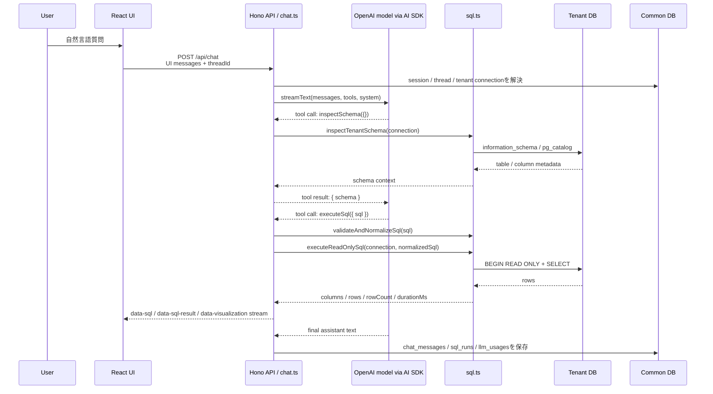
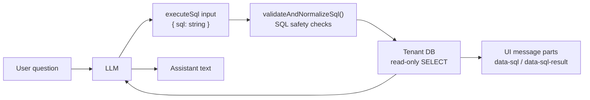
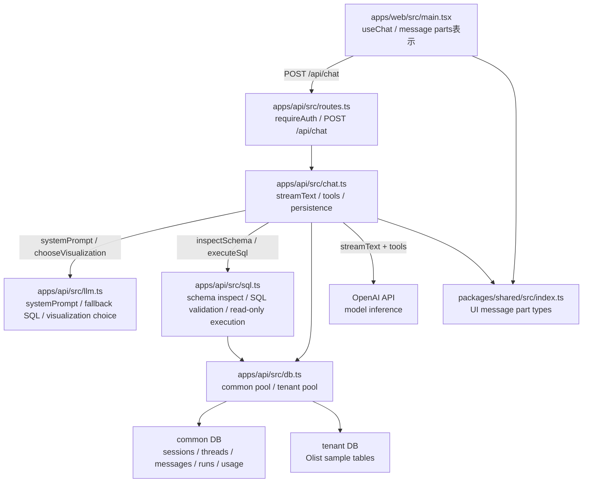
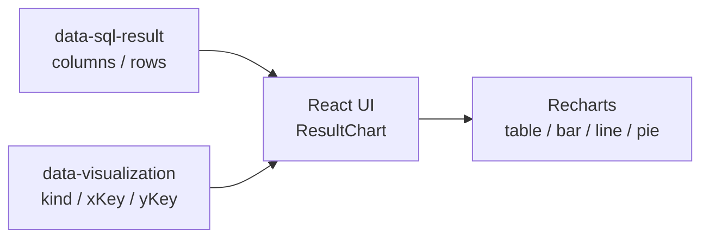

# AIエージェントにおけるtool

このドキュメントは、AIエージェントにおけるtoolの意味、tool callingの実行構造、このrepoでのtool境界、toolへ切り出す判断基準をまとめる。

参照元:

- [apps/api/src/chat.ts](../apps/api/src/chat.ts)
- [apps/api/src/llm.ts](../apps/api/src/llm.ts)
- [apps/api/src/sql.ts](../apps/api/src/sql.ts)
- [apps/web/src/main.tsx](../apps/web/src/main.tsx)
- [packages/shared/src/index.ts](../packages/shared/src/index.ts)
- [docs/AI_SDK.md](AI_SDK.md)
- [AI SDK tool usage](https://github.com/vercel/ai/blob/main/content/docs/04-ai-sdk-ui/03-chatbot-tool-usage.mdx)

## Toolとは何か

AIエージェントにおけるtoolとは、LLMが自然言語回答だけでは完結できない処理を、型付きの関数呼び出しとして外部へ依頼するための公開口である。

通常のLLM応答は「文章を生成する」だけである。一方でtool callingでは、modelが次を返せる。

- どのtoolを呼ぶか。
- そのtoolへ渡すJSON引数は何か。
- tool結果を受けて、次に回答するか、別のtoolを呼ぶか。

したがってtoolは「LLMに任意コードを実行させる仕組み」ではない。実行するのは常にアプリケーション側のコードである。LLMが決めるのは、定義済みtoolの名前と、schemaで許可された入力値だけである。

このrepoでは `apps/api/src/chat.ts` に次の2つのtoolを定義している。

| Tool | 入力 | 実行するサーバ処理 | 返す値 |
| --- | --- | --- | --- |
| `inspectSchema` | `{}` | tenant DBの許可済みschemaを取得する | `{ schema: string }` |
| `executeSql` | `{ sql: string }` | SQLを検証・正規化し、read-only transactionで実行する | SQL結果、またはsanitized error |

重要なのは、`executeSql` が「LLMのSQLをそのまま実行する関数」ではない点である。`executeSql` の内部では必ず `validateAndNormalizeSql()` と `executeReadOnlySql()` を通す。tool callは信用境界ではなく、信用境界はtool内部のサーバ実装である。

## Tool Callingの仕組み

AI SDKでは、`streamText()` に `tools` を渡すことで、modelが呼べるtool一覧を定義する。各toolは次で構成する。

| 要素 | 役割 |
| --- | --- |
| `description` | modelがtoolの用途を判断するための説明 |
| `inputSchema` | modelが渡せる引数のschema |
| `execute` | 実際にサーバ側で実行される関数 |

このrepoの実行ループは `streamText({ tools, stopWhen: stepCountIs(5) })` である。modelがtool callを返すと、AI SDKがtoolの `execute` を呼び、tool結果を次のmodel stepへ渡す。`stepCountIs(5)` は、tool結果を踏まえた追加stepを最大5stepまでに制限する停止条件である。



この図での境界は次である。

| 境界 | 内容 |
| --- | --- |
| UI境界 | `apps/web/src/main.tsx` はUI message streamを表示する。SQL実行やschema取得はしない |
| Agent境界 | `apps/api/src/chat.ts` がtoolを定義し、AI SDKのagent loopを制御する |
| Guardrail境界 | `apps/api/src/sql.ts` がSQL検証、許可tableのschema取得、read-only実行を担当する |
| 永続化境界 | `common DB` がchat履歴、SQL監査ログ、token usageの正本である |
| Tenant境界 | tenant DB接続先はcookie sessionから復元したuser/accountで解決し、client指定を受け取らない |

## LLMレスポンスをJSONにしない理由

このrepoでは、LLMの最終レスポンスを `{ "sql": "SELECT ..." }` のようなJSONへ強制していない。これは型制約を入れていないという意味ではなく、SQLを「最終assistant response」ではなく `executeSql` toolの入力として扱っているためである。

現在のSQL提案の型境界は次である。

```ts
executeSql: tool({
  description: "Validate and execute one read-only PostgreSQL SELECT SQL. Returns sanitized errors for revision.",
  inputSchema: z.object({
    sql: z.string().describe("One PostgreSQL SELECT statement.")
  }),
  execute: async ({ sql }) => runSqlTool(...)
})
```

この `inputSchema` により、LLMが `executeSql` を呼ぶ場合の引数は概念的に次の形へ制約される。

```json
{
  "sql": "SELECT ..."
}
```

つまり、このrepoでは `{ sql: string }` という型制約を「最終レスポンス」ではなく「tool callの引数」に置いている。

JSON modeやstructured outputを使う設計では、典型的にはLLMから次のような最終出力を受け取る。

```json
{
  "sql": "SELECT ..."
}
```

その後、アプリケーション側がJSONをparseし、SQLを検証し、DBへ実行する。この方式は「SQLを1回生成して終わる」処理には合う。一方、このrepoのText-to-SQLは単発のSQL生成ではなく、次のmulti-step loopである。

1. `inspectSchema` toolでtenant schemaを確認する。
2. LLMが `executeSql({ sql })` を呼ぶ。
3. サーバがSQLを検証・正規化・read-only実行する。
4. 失敗した場合はsanitized errorをLLMへ返す。
5. LLMがSQLを修正して再度 `executeSql` を呼ぶ。
6. 成功したSQL結果をもとに、最終回答とUI message partsをstreamする。

この流れでは、SQLは回答本文ではなく、agentが途中で使う操作入力である。そのため、最終レスポンスをJSONへ固定するより、tool inputとして `{ sql: string }` を定義する方が責務境界に合う。



また、JSON modeは安全境界ではない。`{ "sql": string }` を強制しても、その文字列が安全なSQLである保証はない。たとえば、DDL、DML、複数statement、危険関数、重すぎるquery、tenant境界違反は、JSON schemaだけでは防げない。したがって、このrepoでは `executeSql` tool内部で必ず `validateAndNormalizeSql()` と `executeReadOnlySql()` を通す。

使い分けは次である。

| 方式 | 向いている用途 | このrepoでの扱い |
| --- | --- | --- |
| JSON mode / structured output | LLMから最終的に固定schemaのデータだけを受け取りたい | SQLを1回生成するだけなら候補になる |
| Tool calling + `inputSchema` | LLMに外部処理を呼ばせ、結果を見て次stepへ進ませたい | 現行採用 |
| サーバ側guardrail | LLM出力を未信頼入力として検証・権限制御・監査したい | 必須 |

したがって、このrepoの結論は「LLMレスポンスの型を強制しない」ではない。「最終assistant responseをJSONに固定せず、SQL提案は `executeSql` の `inputSchema` で型を狭め、SQL安全性はtool内部のguardrailで保証する」である。

## このrepoのモジュール関係



`chat.ts` はtool定義を持つが、DBアクセスの詳細は `sql.ts` と `db.ts` へ委譲している。この分離により、LLM向けのagent loopと、SQLの安全性を守るguardrailを混ぜない構造になっている。

## Toolに切り出す観点

toolへ切り出すべき処理は、LLMが「必要に応じて選択」する価値があり、かつサーバ側で境界を閉じ込める必要がある処理である。判断基準は次である。

| 観点 | Tool化する理由 | このrepoでの例 |
| --- | --- | --- |
| 外部状態を読む | modelの事前知識では答えられない現在の状態が必要である | `inspectSchema` |
| 副作用または高リスク処理がある | 入力検証、権限、監査、timeoutが必要である | `executeSql` |
| 失敗から修正できる | tool errorをmodelに返し、次stepで修正させる価値がある | SQL validation errorからの再生成 |
| 入出力契約を固定できる | JSON schemaで入力を狭められる | `executeSql({ sql: string })` |
| 実行結果を監査したい | 何を実行したかをDBに残す必要がある | `sql_runs` |

逆に、次の処理はtool化しない方がよい。

| 処理 | Tool化しない理由 |
| --- | --- |
| 単なるUI変換 | LLM round tripが不要で、clientで決定的に処理できる |
| 既に取得済みデータの表示切り替え | 前回 `data-sql-result` を再利用すれば足りる |
| アプリ内部の純粋関数 | modelが選択する必要がなく、通常の関数呼び出しでよい |
| React component生成 | UI実装詳細がtool契約に漏れ、表示が不安定になる |
| guardrailを迂回する処理 | tool化しても安全にはならない。tool内部で検証できないなら公開しない |

このrepoでグラフ描画をtoolにしていないのは、この判断基準による。グラフ描画は、SQL実行結果の `columns` と `rows` から `table` / `bar` / `line` / `pie` を表示するUI処理であり、DBや外部サービスへアクセスしない。したがって `data-visualization` という小さな宣言的specをstreamし、描画はWeb側で決定的に行う。

ここで分けるべき境界は、「可視化をどう表示するか」と「どの可視化が適切かを判断するか」である。前者はReact/Rechartsの責務であり、toolではない。後者も現在は `chooseVisualization(question, result)` という通常関数で足りている。tool化を検討する余地があるのは、複数の統計量、列の意味、ユーザーの分析意図を踏まえて高度な可視化specを提案する必要が出た場合だけである。その場合でも、toolにする対象は「描画実行」ではなく「安全な可視化specの提案」までに限定する。



この流れでは、LLMはグラフを描画しない。サーバは描画に必要なtyped dataと小さなspecを返し、clientが決定的に描画する。これにより、表示切り替えのたびにLLM round tripを発生させず、React componentやchart libraryの詳細をtool契約から隠せる。

## Tool設計の実務ルール

このrepoでtoolを追加する場合は、次を満たすことを完了条件にする。

1. `description` は、modelがいつ使うべきか判断できる粒度で書く。
2. `inputSchema` は最小にする。未使用のoptionや自由度の高いobjectを増やさない。
3. `execute` の入口で認証、tenant、権限、入力検証、timeoutを確認する。
4. tool結果はmodelとUIへ返してよい情報だけに丸める。内部エラー、接続情報、stack traceは返さない。
5. 副作用またはDBアクセスがあるtoolは監査ログへ残す。
6. 再試行可能な失敗は、modelが修正できる短いerror code/messageへ正規化する。
7. toolを増やす前に、通常のサーバ関数、UI処理、prompt制約で足りない理由を確認する。

`executeSql` はこのルールの代表例である。modelから来る `sql` は `inputSchema` 上は文字列にすぎないため、tool内部でさらにAST検証、危険keyword拒否、`LIMIT` 正規化、read-only transaction、statement timeoutを適用する。

## Tool CallingとAgent Frameworkの違い

tool callingは、modelが1リクエスト内で外部関数を呼ぶための仕組みである。agent frameworkは、session、memory、workflow state、複数agent coordination、長時間実行などを含む実行基盤である。

このrepoのMVPでは、AI SDKの `streamText` とtool callingで十分である。理由は、永続化の正本がagent runtimeではなく、アプリケーションDBの `chat_threads`、`chat_messages`、`sql_runs`、`llm_usages` にあるためである。

将来、次の要件が出た場合は、tool callingだけでなくagent frameworkやmanaged agent runtimeの採用を再検討する。

- tool実行履歴をまたいだ長期的なagent stateが必要である。
- 複数agentが役割分担して同じ業務を進める。
- 人間の承認待ちを含む長時間workflowをagent runtime側で保持したい。
- memory、artifact、session stateをアプリDBではなくagent基盤側の正本にしたい。

## まとめ

このrepoにおけるtoolは、LLMにDB操作を自由に任せるための穴ではなく、LLMが必要な外部処理を要求できる型付きAPIである。安全性、tenant境界、SQL検証、監査ログはすべてサーバ側に残す。

toolへ切り出す対象は、外部状態、リスク、監査、再試行価値がある処理に限る。純粋なUI変換や通常のアプリ内部処理はtoolにしない。この境界を保つことで、agent loopを小さく保ちつつ、Text-to-SQLに必要なschema確認、SQL実行、結果表示を安全に接続できる。
